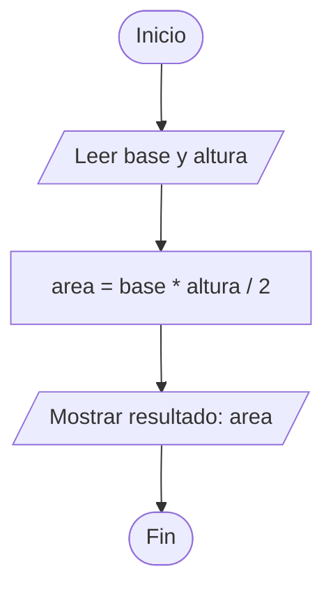

## UNIDAD 1: FUNDAMENTOS DE ALGORITMOS Y PROGRAMAS 
---
[🔙 Volver al Índice Principal](./README.md)
###  Contenidos
En esta unidad exploramos los fundamentos de la lógica de programación. Los temas principales incluyeron:

* **Algoritmo y Pseudocódigo:** Estructuración lógica de procesos.
* **Diagrama de Flujo:** Representación visual de algoritmos.
* **Prueba de Escritorio:** Validación manual de la lógica.
* **Lenguajes de Programación:** Diferencias y propósitos.
* **Programación por Bloques:** Introducción visual a la lógica.
## 1. Algoritmo y Pseudocódigo

La **estructuración lógica** es el cimiento de cualquier programa. Antes de codificar, debemos definir el camino que seguirán los datos.

### El Algoritmo
Es una serie de pasos **ordenados, finitos y precisos** para resolver un problema. Sus componentes básicos son:
* **Entrada:** Los datos iniciales.
* **Proceso:** Operaciones y decisiones lógicas.
* **Salida:** El resultado final.

### El Pseudocódigo
Es una "falsa programación" que utiliza lenguaje humano (natural) para describir la lógica de un algoritmo. Su objetivo es facilitar la comprensión de la solución sin preocuparse por la sintaxis estricta de un lenguaje como C++ o Python.

> **Estructura lógica general:**
> 1. **Inicio**
> 2. Declarar variables y constantes.
> 3. Leer datos de entrada.
> 4. Realizar cálculos o procesos.
> 5. Mostrar resultados (Salida).
> 6. **Fin**

## 2. Diagrama de Flujo

Es la **representación visual** de un algoritmo. Utiliza símbolos estandarizados para mostrar el flujo de control y la relación entre los pasos del proceso.

### Simbología Básica
* **Óvalo (Inicio/Fin):** Indica el comienzo y el término del proceso.
* **Paralelogramo (Entrada/Salida):** Representa la lectura de datos o la impresión de resultados.
* **Rectángulo (Proceso):** Indica cualquier operación aritmética o asignación de variables.
* **Rombo (Decisión):** Representa una bifurcación lógica (Sí/No) basada en una condición.
* **Flechas (Líneas de flujo):** Indican el orden de ejecución de las instrucciones.

### Ventajas de su uso
1. **Claridad Visual:** Facilita la comprensión de procesos complejos de un solo vistazo.
2. **Detección de Errores:** Permite identificar saltos lógicos incorrectos o bucles infinitos antes de programar.
3. **Documentación:** Sirve como guía técnica para que otros desarrolladores entiendan la lógica sin leer código.

### 4. Diagrama de Flujo (Generado con Código)


---
## 3. Prueba de Escritorio

Es una técnica de **validación manual** que permite verificar la lógica de un algoritmo o pseudocódigo antes de ser implementado en un lenguaje de programación.

### ¿En qué consiste?
Se trata de simular la ejecución del algoritmo paso a paso utilizando valores de entrada específicos. Para ello, se suele utilizar una tabla donde:
* Cada columna representa una **variable** del algoritmo.
* Cada fila representa un **cambio de estado** o un paso ejecutado.

### Objetivos Principales
1. **Verificar la lógica:** Asegurar que el algoritmo produzca el resultado esperado.
2. **Detectar errores tempranos:** Identificar fallos lógicos o "bugs" antes de la fase de codificación.
3. **Seguimiento de variables:** Observar cómo cambian los valores a lo largo del proceso.

> **Consejo:** Si tu prueba de escritorio arroja un resultado erróneo, el problema está en la lógica del algoritmo (el diseño), no en la sintaxis.
## 4. Lenguajes de Programación

Son herramientas que permiten al programador comunicarse con la computadora. Se encargan de traducir nuestras instrucciones lógicas a un formato que el hardware pueda procesar.

### Diferencias y Propósitos
Los lenguajes se clasifican principalmente según su cercanía al hardware:

* **Lenguajes de Bajo Nivel:** Como el *Ensamblador*. Tienen control total sobre el hardware pero son extremadamente difíciles de leer para humanos.
* **Lenguajes de Alto Nivel:** Como *Python, Java o C#*. Utilizan palabras similares al inglés, facilitando la escritura y mantenimiento del código.

### Clasificación por Ejecución
1.  **Compilados:** Un programa llamado compilador traduce todo el código de una vez (ej. C++, Rust). Son muy rápidos.
2.  **Interpretados:** El código se traduce línea por línea en tiempo real (ej. Python, JavaScript). Son más flexibles para el desarrollo rápido.

> **Propósito:** Cada lenguaje existe para resolver un problema diferente: **Python** para datos e IA, **JavaScript** para la web, y **C** para sistemas de alto rendimiento.

## 5. Programación por Bloques

Es una **introducción visual** a la lógica de programación diseñada para facilitar el aprendizaje eliminando las barreras de la sintaxis escrita.

### Características Principales
* **Interfaz Visual:** En lugar de escribir código, se "encajan" piezas gráficas que representan comandos (como piezas de un rompecabezas).
* **Prevención de Errores:** Las piezas solo encajan si la lógica es coherente (ej. no puedes encajar un bloque de texto donde va un número).
* **Enfoque en la Lógica:** Permite que el estudiante se concentre en entender conceptos como **bucles, condicionales y variables** sin preocuparse por olvidar un punto y coma `;`.

### Herramientas Comunes
1. **Scratch:** La plataforma más popular para crear historias y juegos mediante bloques.
2. **Blockly:** Una biblioteca de Google que permite exportar los bloques a código real (como Python o JavaScript).
3. **App Inventor:** Utilizada para desarrollar aplicaciones móviles de forma visual.

> **Conclusión de la Unidad:** La programación por bloques es el puente perfecto para entender el pensamiento computacional antes de pasar a lenguajes basados en texto.

# Ejercicio: Estructura Secuencial

Este ejercicio pone en práctica el flujo lineal de un algoritmo, donde cada instrucción sigue a la anterior sin saltos ni repeticiones.

### 1. Planteamiento del problema
*Realizar un programa que calcule el área de un triángulo a partir de su base y su altura, ingresadas por el usuario.*

### 2. Análisis del problema
* **Entradas:** * Base (b) - Tipo: Real
    * Altura (h) - Tipo: Real
* **Proceso:** * Aplicar la fórmula matemática: `Area = (base * altura) / 2`
* **Salida:** * El valor calculado del Área.

### 3. Diseño del algoritmo

#### Pseudocódigo
```Text
Algoritmo CalcularAreaTriangulo
    Definir base, altura, area Como Real
    Escribir "Ingrese la base del triángulo:"
    Leer base
    Escribir "Ingrese la altura del triángulo:"
    Leer altura
    area <- (base * altura) / 2
    Escribir "El área es: ", area
FinAlgoritmo
```
### 4. Codificación (Código Fuente en Lenguaje C)

Este código implementa la lógica secuencial utilizando la librería estándar de entrada y salida.

```c
#include <stdio.h>

int main() {
    // Declaración de variables
    float base, altura, area;

    // Entrada de datos
    printf("Ingrese la base del triángulo: ");
    scanf("%f", &base);

    printf("Ingrese la altura del triángulo: ");
    scanf("%f", &altura);

    // Proceso (Estructura secuencial)
    area = (base * altura) / 2;

    // Salida de resultados
    printf("El área resultante es: %.2f\n", area);

    return 0;
}
````
### 5. Validación (Prueba de Escritorio)

La prueba de escritorio permite seguir el rastro de las variables paso a paso para asegurar que el cálculo sea correcto.

A continuación, se presentan tres ejercicios prácticos para validar la lógica secuencial, identificando el flujo desde la entrada hasta la salida.

Para verificar que el algoritmo sea correcto, aplicamos la misma lógica (`Area = (base * altura) / 2`) con tres juegos de datos distintos.

#### Ejercicio 1: Valores Enteros Estándar
| Entrada (Datos) | Variables (Memoria) | Proceso (Lógica) | Salida (Resultado) |
| :--- | :--- | :--- | :--- |
| base=20, altura=10 | b=20, h=10 | (20 * 10) / 2 | **Área: 100** |

#### Ejercicio 2: Valores con Decimales (Tipo Real)
| Entrada (Datos) | Variables (Memoria) | Proceso (Lógica) | Salida (Resultado) |
| :--- | :--- | :--- | :--- |
| base=5.5, altura=3.0 | b=5.5, h=3.0 | (5.5 * 3.0) / 2 | **Área: 8.25** |

#### Ejercicio 3: Triángulo de Base Pequeña
| Entrada (Datos) | Variables (Memoria) | Proceso (Lógica) | Salida (Resultado) |
| :--- | :--- | :--- | :--- |
| base=1, altura=15 | b=1, h=15 | (1 * 15) / 2 | **Área: 7.5** |

---

### Resumen del Flujo de Datos
1. **Entrada:** Se capturan los datos de base y altura.
2. **Variables:** Se asignan los valores a identificadores en memoria.
3. **Proceso:** Se aplica la expresión matemática secuencial.
4. **Salida:** Se retorna el valor final al usuario.
5.**
---

## Principales Dificultades y Reflexión Crítica

A lo largo del desarrollo de esta unidad, se han identificado retos significativos que forman parte del proceso de aprendizaje de cualquier programador principiante.

### Principales Dificultades

* **Abstracción de la Lógica:** Pasar de un problema cotidiano a un algoritmo estructurado es el mayor reto. Entender que la computadora no "supone" nada y que cada paso debe ser explícito fue una dificultad inicial común.
* **Sintaxis vs. Lógica:** Al principio, es fácil frustrarse por olvidar un punto y coma (`;`) en Lenguaje C o cerrar mal un bloque de código, lo que a veces distrae de lo más importante: entender si la solución lógica es correcta.
* **Jerarquía de Operaciones:** En ejercicios secuenciales como el del área del triángulo, un error frecuente es no utilizar correctamente los paréntesis, lo que altera el resultado final del proceso matemático.
* **Manejo de Tipos de Datos:** Diferenciar cuándo usar un `Entero` o un `Real` (float) genera confusión al inicio, especialmente cuando los resultados esperados tienen decimales.

### Reflexión Crítica

La programación no se trata simplemente de escribir código en una computadora, sino de **aprender a pensar de forma estructurada**. Herramientas como el **Pseudocódigo** y los **Diagramas de Flujo** son fundamentales, ya que permiten "ver" la solución antes de pelearse con las reglas de un lenguaje técnico.

La **Prueba de Escritorio** resultó ser la herramienta más reveladora: nos enseña que un programa no es una "caja negra" mágica, sino una serie de cambios de estado en la memoria. Como principiante, esta unidad me ha permitido entender que la base del éxito en la programación es la **paciencia y el orden**; si la lógica inicial está mal planteada, no hay lenguaje de programación que pueda salvar el resultado.

---
## Bibliografía

## Bibliografía (Formato IEEE)

[1] M. A. Rodríguez-Almeida, *Fundamentos de Programación: Algoritmos y Estructura de Datos*, 2da ed. Madrid, España: McGraw-Hill, 2020. [En línea]. Disponible: https://www.mheducation.es/fundamentos-de-programacion-9788448618827-espanol

[2] B. W. Kernighan y D. M. Ritchie, *El Lenguaje de Programación C*, 2da ed. México: Prentice Hall, 1991. [En línea]. Disponible: https://archive.org/details/the-c-programming-language-2nd-edition-bernanrd-w.-kernighan-dennis-m.-ritchie

[3] J. Maloney, M. Resnick, N. Rusk, B. Silverman y E. Eastmond, "The Scratch Programming Language and Environment", *ACM Transactions on Computing Education*, vol. 10, no. 4, pp. 1-15, nov. 2010. [En línea]. Disponible: https://web.media.mit.edu/~jmaloney/papers/ScratchSpecialIssue.pdf

---

## Declaración de Uso de IA Generativa

**Responsabilidad y Transparencia**

En cumplimiento con las normas de integridad académica, declaro que para la elaboración de este portafolio de la Unidad 1 se contó con el apoyo de **IA Generativa (Gemini)**.
