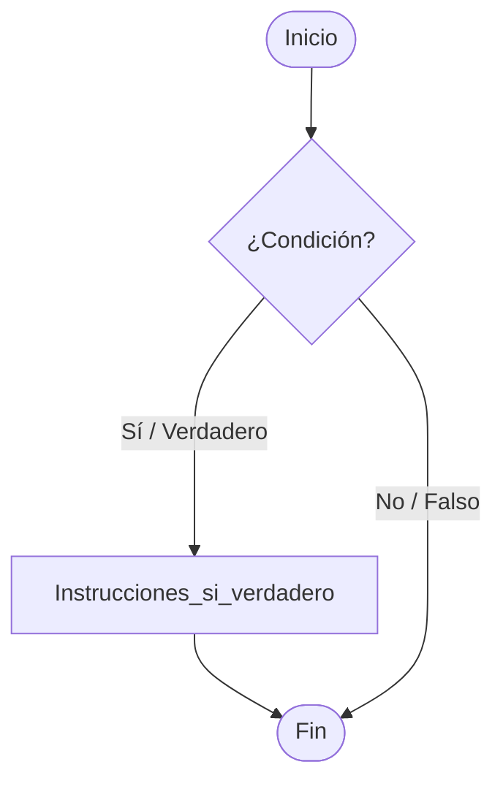
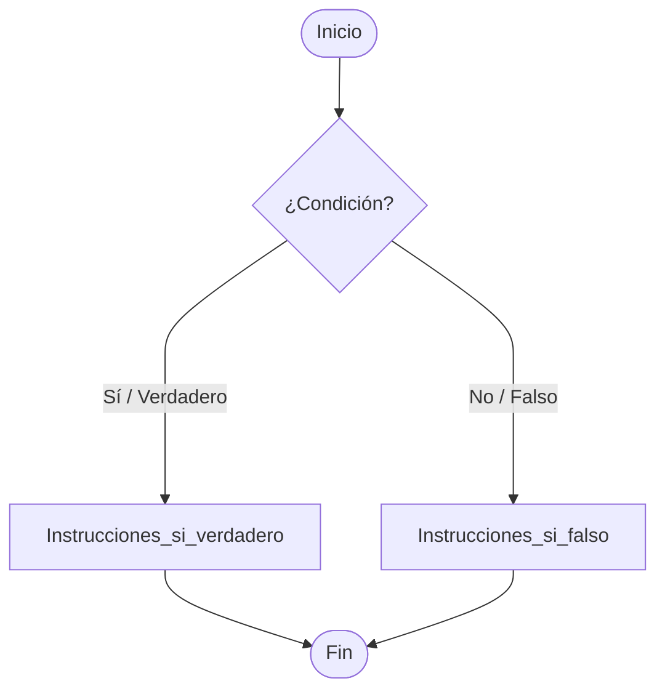
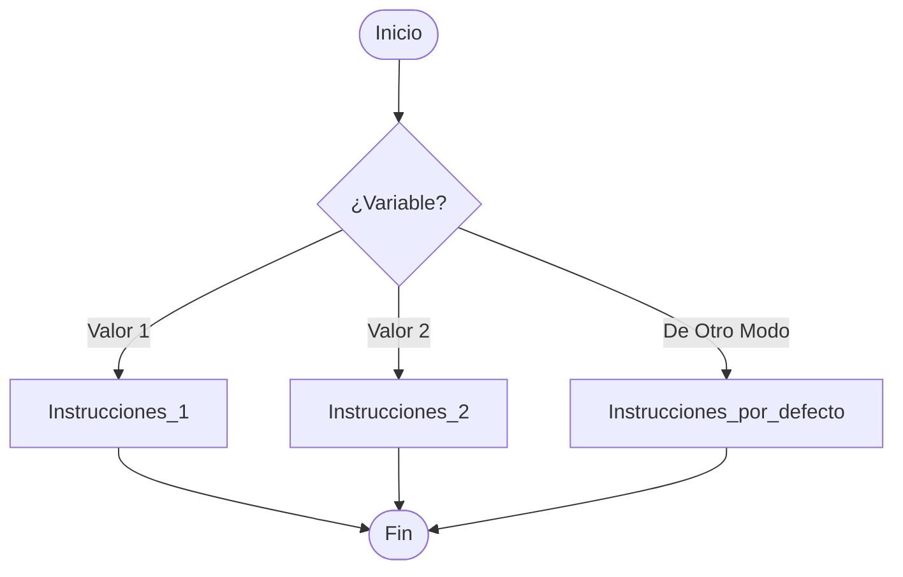
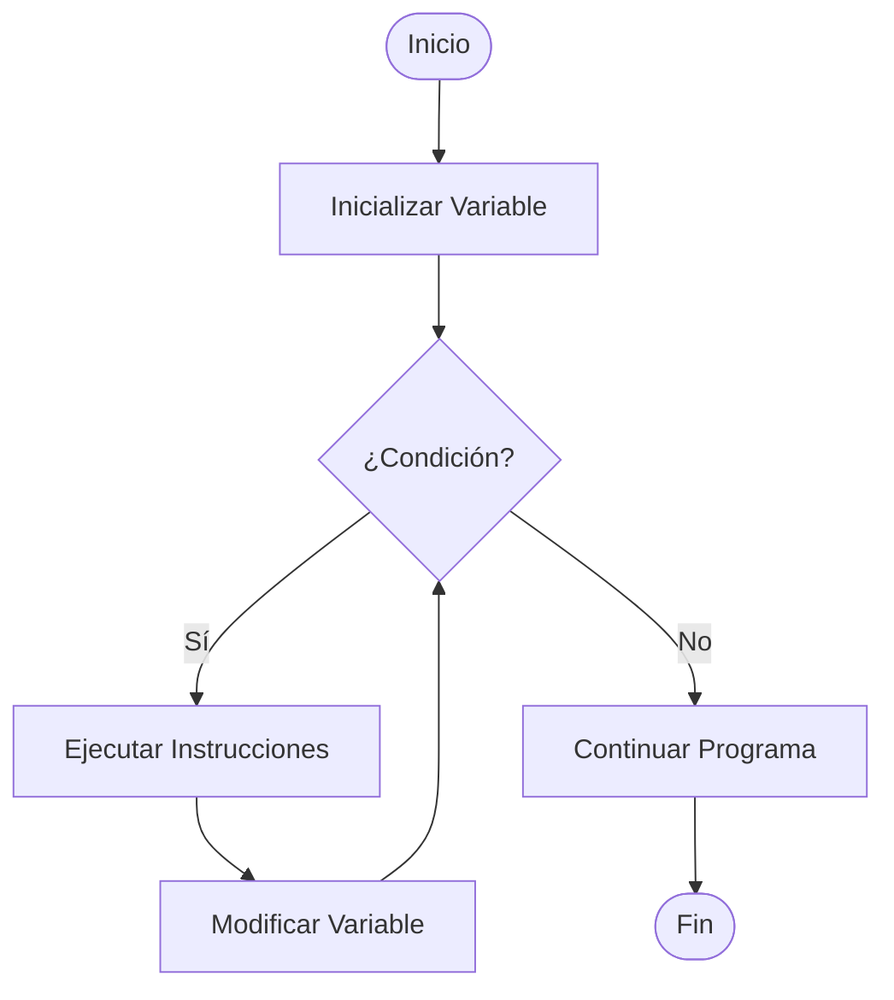
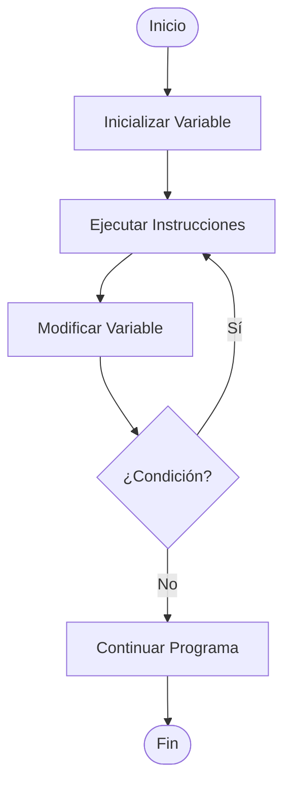
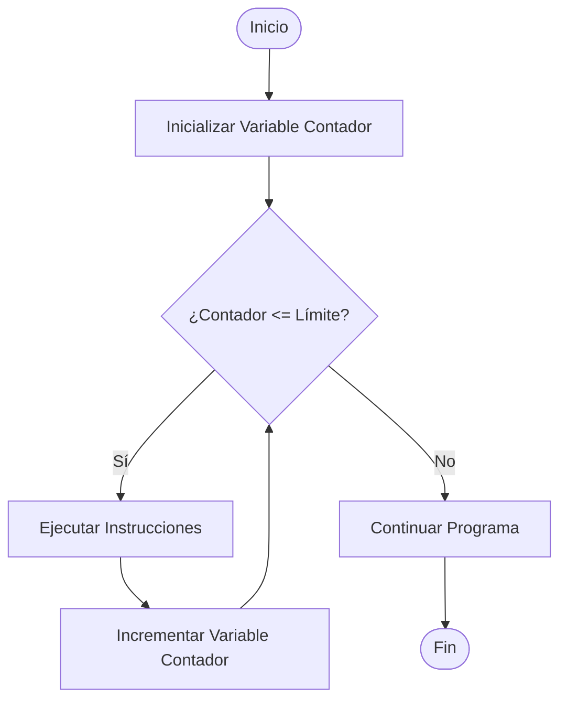
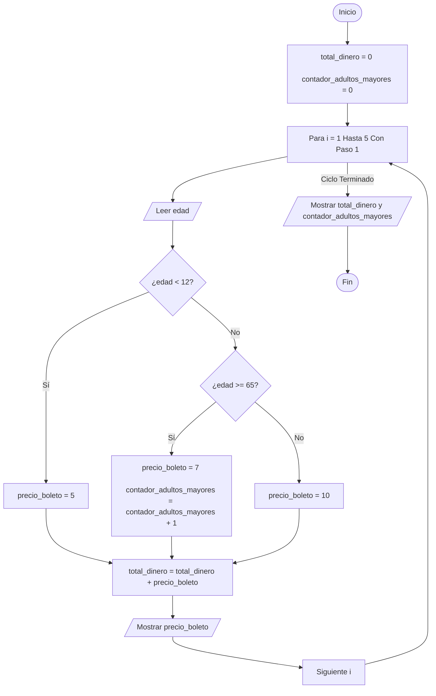

<div align="center" style="margin-bottom: 35px; border-top: 2px solid #58a6ff; border-bottom: 2px solid #58a6ff; padding: 20px 0;">
  <h1 style="color: #58a6ff; font-size: 28px; font-weight: 800; letter-spacing: 3px; margin: 0; text-transform: uppercase; font-family: 'Segoe UI', system-ui, sans-serif;">
    UNIDAD II: ESTRUCTURAS ALGORÍTMICAS DE CONTROL
  </h1>
  <div style="color: #8b949e; font-size: 14px; font-style: italic; margin-top: 8px; letter-spacing: 1px;">
    — Bifurcaciones, Decisiones e Iteraciones en el Flujo Lógico —
  </div>
</div>

---
[🔙 Volver al Índice Principal](./README.md)

# 1. Estructuras Condicionales
Las estructuras condicionales permiten a un programa tomar decisiones y ejecutar diferentes bloques de código según se cumpla o no una condición lógica (evaluada como verdadera o falsa). Son la base de la lógica en cualquier lenguaje de programación.

---

## 1.1 Condicional Simple (if)

Un if en programación es una estructura de control que permite tomar decisiones y dirigir el flujo de un programa basándose en condiciones. Funciona evaluando una condición; si esta es verdadera, ejecuta un bloque de código. Si es falsa, el programa ignora ese bloque y continúa su curso

### Pseudocódigo
```text
Si condición Entonces
    Instrucciones_si_verdadero
FinSi
```

### Diagrama de Flujo
*   Un rombo contiene la **Condición**.
*   Una flecha etiquetada como **Sí / Verdadero** sale del rombo hacia el bloque de instrucciones.
*   Una flecha etiquetada como **No / Falso** sale del rombo y esquiva el bloque de instrucciones, continuando el flujo normal.




---

## 1.2 Condicional doble (if-else)

El condicional doble (if-else) actúa como una bifurcación en el camino: si la condición se cumple, el programa toma la ruta A; si no se cumple, toma obligatoriamente la ruta B.

### Pseudocódigo
```text
Si condición Entonces
    Instrucciones_si_verdadero
Sino
    Instrucciones_si_falso
FinSi
```

### Diagrama de Flujo
*   Un rombo contiene la **Condición**.
*   La flecha de **Sí / Verdadero** va hacia un bloque de acciones específicas.
*   La flecha de **No / Falso** va hacia un bloque de acciones alternativas diferente.
*   Ambos caminos se unen más abajo para continuar con el programa.


---
## 1.3 Condicional Anidado

Un condicional anidado ocurre cuando colocas una estructura condicional (if o if-else) dentro de otra estructura condicional.Se utiliza cuando necesitas realizar verificaciones de forma secuencial; es decir, para poder evaluar la segunda condición, primero se debe haber cumplido (o fallado) la primera.

### Pseudocódigo
```text
Si (Condicion_Principal) Entonces
    // Código que se ejecuta si la primera condición es verdadera
    
    Si (Condicion_Secundaria) Entonces
        // Código que se ejecuta solo si AMBAS condiciones son verdaderas
    Sino
        // Código que se ejecuta si la primera es verdadera, pero la segunda es falsa
    FinSi
    
Sino
    // Código que se ejecuta si la primera condición es falsa desde el principio
FinSi

```

### Diagrama de Flujo
*   Un rombo o un selector especial contiene la **Variable** o **Condición principal**.
*   Salen múltiples flechas (tantas como casos existan), cada una con el **Valor esperado**.
*   Cada flecha lleva a su propio bloque de instrucciones.
*   Existe una flecha final opcional para el caso **De Otro Modo** (si ningún valor coincide).
*   Todas las líneas se unifican al terminar los bloques de código.
  ```mermaid
graph TD
    A([Inicio]) --> B{¿Condición Principal?}
    
    B -- Sí --> C{¿Condición Secundaria A?}
    B -- No --> D{¿Condición Secundaria B?}
    
    C -- Sí --> E[Instrucciones A1]
    C -- No --> F[Instrucciones A2]
    
    D -- Sí --> G[Instrucciones B1]
    D -- No --> H[Instrucciones B2]
    
    E --> I[Unificación Camino A]
    F --> I
    
    G --> J[Unificación Camino B]
    H --> J
    
    I --> K[Salida Condicional Anidado]
    J --> K
    
    K --> L([Fin])

```


## 1.4 Condicional Múltiple (switch)

Un condicional múltiple (también conocido como estructura de selección múltiple o evaluación por casos) es una estructura de control que permite evaluar una sola variable o expresión contra múltiples valores posibles, ejecutando un bloque de código diferente para cada caso.
Se utiliza para reemplazar largas cadenas de if - else if - else cuando necesitas comparar la misma variable con muchos valores exactos, haciendo que el código sea mucho más limpio, ordenado y fácil de leer.
En la mayoría de los lenguajes de programación, esta estructura se implementa con la palabra clave switch o match (en lenguajes modernos como Python)

### Pseudocódigo
```text
Según variable Hacer
    valor1:
        Instrucciones_1
    valor2:
        Instrucciones_2
    De Otro Modo:
        Instrucciones_por_defecto
FinSegún
```

### Diagrama de Flujo
*   Un rombo o un selector especial contiene la **Variable** o **Condición principal**.
*   Salen múltiples flechas (tantas como casos existan), cada una con el **Valor esperado**.
*   Cada flecha lleva a su propio bloque de instrucciones.
*   Existe una flecha final opcional para el caso **De Otro Modo** (si ningún valor coincide).
*   Todas las líneas se unifican al terminar los bloques de código.


# 2. Estructuras repetitivas
Las estructuras repetitivas (o bucles) permiten ejecutar un bloque de instrucciones varias veces. Se dividen en tres tipos principales según cómo y cuándo evalúan su condición.

## 2.1 Mientras (While)

El bucle Mientras (While) ejecuta un bloque de código continuamente mientras una condición específica se mantenga como verdadera (true). Es una estructura de control condicional que evalúa la condición antes de entrar al ciclo.
### Pseudocódigo
```text
Mientras condición Hacer
    // Bloque de instrucciones que se repite
    // Aquí se debe modificar la condición para evitar un bucle infinito
FinMientras

```
### Diagrama de Flujo
*   Un rombo inicial contiene la Condición principal que evalúa si el ciclo debe continuar.
*   Salen dos flechas con el Valor esperado: una flecha de Verdadero (Sí) y una flecha de Falso (No).
*   La flecha de Verdadero lleva al bloque de instrucciones que se repite y actualiza la variable de control.
*   Al terminar ese bloque, una línea de retorno se unifica y regresa obligatoriamente al rombo inicial.La flecha de Falso desvía el flujo, saltándose el código interno para continuar con el resto del programa.



## 2.2 Hacer-Mientras (Do-While)

El bucle Hacer-Mientras (Do-While), también conocido en pseudocódigo como Repetir-Hasta Que, es una estructura de control repetitiva que ejecuta un bloque de instrucciones al menos una vez antes de evaluar su condición.
### Pseudocódigo
```text
Repetir
    // Bloque de instrucciones (se ejecuta siempre al menos una vez)
    // Aquí se modifica la variable de control
Hasta Que condición


```
### Diagrama de Flujo
*   Un bloque inicial de instrucciones ejecuta las acciones del ciclo y actualiza la variable de control por primera vez.
*   Un rombo final recibe el flujo directamente de este bloque para evaluar la Condición principal.
*   Salen dos flechas con el Valor esperado: una flecha de Verdadero (Sí) y una flecha de Falso (No).
*   La flecha de Verdadero es una línea de retorno que sube y se unifica obligatoriamente antes del bloque de instrucciones inicial para repetir el ciclo.
*   La flecha de Falso continúa el flujo de manera directa hacia abajo, saliendo definitivamente del bucle para seguir con el resto del programa



## 2.3 Para (For)
El bucle Para (For) es una estructura de control repetitiva que se utiliza cuando se conoce de antemano el número exacto de veces que se debe ejecutar un bloque de instrucciones.
### Pseudocódigo
```text
Para variable <- valor_inicial Hasta valor_final Con Paso incremento Hacer
    // Bloque de instrucciones principales
    // La variable de control se modifica automáticamente en cada vuelta
FinPara
```
### Diagrama de Flujo
*   Un bloque de proceso inicial establece la Inicialización de la variable de control (por ejemplo, i = 1).
*   Un rombo o selector especial evalúa el límite del ciclo mediante la Condición principal.
*   Salen dos flechas con el Valor esperado: una flecha de Verdadero (Sí) y una flecha de Falso (No).
*   La flecha de Verdadero dirige el flujo hacia el bloque de instrucciones principales del bucle para su ejecución.
*   Al terminar las instrucciones, el flujo pasa a un bloque de Modificación / Incremento que actualiza el valor de la variable de control.
*   Una línea de retorno nace de este último bloque y se unifica directamente antes del rombo de condición para volver a evaluarla.
*   La flecha de Falso se activa cuando el contador supera el límite establecido, desviando el flujo hacia afuera para continuar con el programa.

# 3. Ejercicio con estructura condicional y repetitiva (lenguaje dado en clase).
## Planteamiento de problema
Una empresa de transporte interprovincial necesita un sistema automatizado para gestionar la venta de boletos de un autobús con capacidad para 5 pasajeros. El precio base del boleto es de $10.
El sistema debe solicitar la edad de cada pasajero para aplicar descuentos especiales según las políticas de la empresa:
*   Niños (menores de 12 años): Tienen un 50% de descuento (pagan $5).
*   Adultos mayores (65 años o más): Tienen un 30% de descuento (pagan $7).
*   Pasajeros regulares (entre 12 y 64 años): Pagan la tarifa completa ($10).
Al llenarse el autobús (completarse los 5 pasajeros), el programa debe detenerse y mostrar el dinero total recaudado y cuántos adultos mayores abordaron el vehículo.
## Análisis del problema
Entradas:
*   La edad de cada pasajero (número entero). Se solicitará de forma consecutiva.
  
Procesamiento:
*   Estructura repetitiva: Un ciclo Para (o For) que se repita exactamente 5 veces (una por cada asiento).
*   Estructura condicional: Un Si-Entonces-Sino anidado para evaluar la edad del pasajero y asignar el precio del boleto correspondiente ($5, $7 o $10).
*   Contador: Una variable para contar cuántos pasajeros pertenecen a la categoría de adultos mayores.
*   Acumulador: Una variable para sumar el precio de cada boleto vendido y obtener el gran total.
  
Salidas:
*   El costo del boleto para cada pasajero individualmente.El total de dinero recaudado por el autobús.La cantidad total de adultos mayores que viajan.
## Diseño del algoritmo (diagrama de flujo)

##  Codificación (código fuente)

```text
#include <stdio.h>

int main() {
    // Variables para guardar los totales
    float total_dinero = 0.0;
    int contador_adultos_mayores = 0;
    
    // Variables temporales para el ciclo
    int edad;
    float precio_boleto;
    int i;

    printf("--- SISTEMA DE VENTAS DE BOLETOS ---\n");

    // Ciclo para los 5 pasajeros
    for(i = 1; i <= 5; i++) {
        printf("\nPasajero Nro %d\n", i);
        printf("Ingrese la edad del pasajero: ");
        scanf("%d", &edad);
        
        // Revisamos los descuentos segun la edad
        if (edad < 12) {
            precio_boleto = 5.0;
            printf("Categoria: Nino (50%% Descuento)\n");
        } 
        else if (edad >= 65) {
            precio_boleto = 7.0;
            contador_adultos_mayores = contador_adultos_mayores + 1; // Sumamos uno al contador
            printf("Categoria: Adulto Mayor (30%% Descuento)\n");
        } 
        else {
            precio_boleto = 10.0;
            printf("Categoria: Regular (Tarifa Completa)\n");
        }
        
        // Mostramos el precio de este boleto y lo sumamos al total
        printf("Costo del boleto: $%.2f\n", precio_boleto);
        total_dinero = total_dinero + precio_boleto;
    }

    // Reporte final al terminar el ciclo
    printf("\n====================================\n");
    printf("--- REPORTE FINAL DEL AUTOBUS ---\n");
    printf("Total de dinero recaudado: $%.2f\n", total_dinero);
    printf("Cantidad de adultos mayores: %d\n", contador_adultos_mayores);
    printf("====================================\n");

    return 0;
}

```
## Validación (prueba de escritorio)
| Entrada (Edad) | Proceso (Cálculo del Boleto) | Salida (Mensaje en Pantalla) |
| :---: | :--- | :--- |
| **8** | Como 8 < 12, se aplica 50% de descuento. <br>Precio = $5.00. | "Categoría: Niño (50% Descuento)" <br> "Costo del boleto: $5.00" |
| **30** | No cumple ninguna condición de descuento. <br>Precio = $10.00. | "Categoría: Regular (Tarifa Completa)" <br> "Costo del boleto: $10.00" |
| **70** | Como 70 >= 65, se aplica 30% de descuento. <br>Precio = $7.00. | "Categoría: Adulto Mayor (30% Descuento)" <br> "Costo del boleto: $7.00" |

## 4. Principales dificultades en la aplicación de los contenidos.
Aplicar estructuras condicionales y repetitivas en el código me daba cierta difícultad porque requiere cambiar la forma natural en que pensamos por una lógica sumamente estricta. Con las condicionales (si pasa esto, haz aquello), el principal tropiezo era olvidar los escenarios intermedios o de error; por ejemplo, planificar qué hacer si llueve o si está soleado, pero congelarse si el clima está nublado. Con las repetitivas (bucles/ciclos), el dolor de cabeza era controlar cuándo detenerse, lo que suele provocar bucles infinitos que traban la computadora, o errores de "desfase" donde una tarea se repite una vez más o una vez menos de lo necesario.
## 5. Reflexion critica 
La reflexión crítica que me deja esto es que programar no es solo escribir código, sino aprender a traducir nuestra intuición cotidiana a un idioma que no acepta ambigüedades. En el día a día tomamos decisiones y repetimos rutinas de forma automática (como revisar el celular hasta que nos dormimos), pero la computadora no tiene sentido común. El verdadero reto y aprendizaje está en desarrollar la empatía digital necesaria para desmenuzar nuestras propias acciones en pasos tan pequeños, claros y lógicos que hasta una máquina sin cerebro los pueda entender a la perfección.

> ### 🤖 Declaración de Uso de IA - Unidad 2
> * **Herramienta utilizada:** Gemini
> * **Uso específico:** Debido a la complejidad lógica de las estructuras condicionales y repetitivas, se utilizó la IA como un tutor de co-pilotaje. Me ayudó a comprender los errores de "desfase" (off-by-one) en los ciclos y a analizar cómo piensa la computadora sin ambigüedades. El código final fue razonado, implementado y probado por el autor.

<p align="left">
  <a href="UNIDAD3.md" style="text-decoration: none; color: #58a6ff; font-weight: bold; font-size: 14px;">Siguiente: Unidad 3 ➡️</a>
</p>


